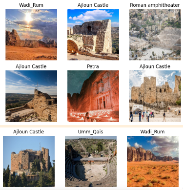
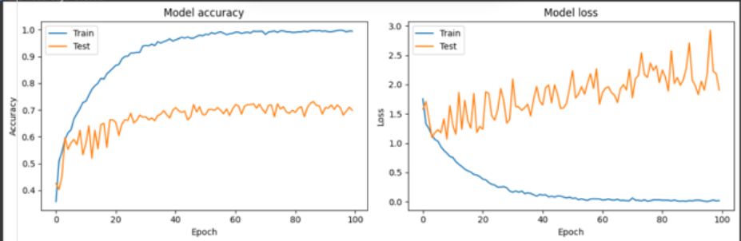
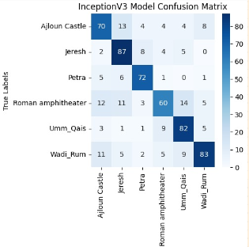
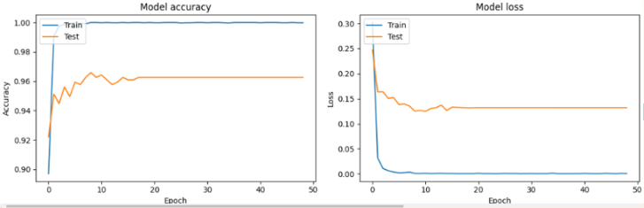
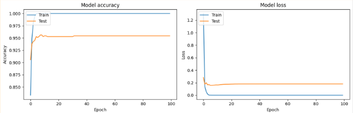
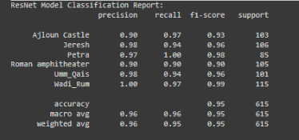
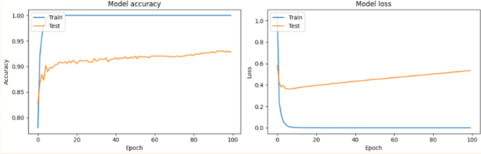
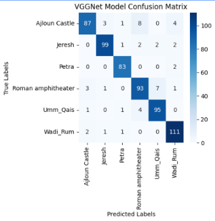
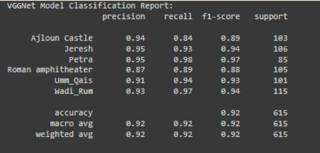

# Jordan Archaeological Sites Pre-traind Image Classification 

## Overview 
Image classification in the context of Jordanian archaeological sites involves utilizing machine learning techniques to categorize images according to the specific archaeological sites they depict.
This task can aid in various applications such as tourism promotion, historical research, and cultural preservation.

## Dataset Collection
The process typically involves collecting a dataset of images featuring different archaeological sites across Jordan, including famous landmarks like Petra, Jerash, and Wadi Rum, among others. 
These images may vary in terms of lighting conditions, angles, and image quality, presenting a challenge for accurate classification.
The dataset for this project was created by collecting images of Jordanian archaeological sites from various website sources [dataset](https://drive.google.com/drive/folders/1ty_T_iXx35HAuSkEgbXiOlwoLjH75jLC?usp=sharing). The dataset consists of images with the following 6 classes:
- Petra
- Wadi_Rum
- Umm_Qais
- Roman amphitheater
- Jeresh
- Ajloun Castle

## Utilizing Pretrained Models
Pretrained models are commonly employed for image classification tasks due to their effectiveness in learning hierarchical features from images. The dataset is divided into training, validation, and testing sets, and the pretrained model is trained on the training data to learn the features that distinguish between different archaeological sites.

### Models Evaluated
During training, the model adjusts its parameters to minimize the classification error, and the performance is evaluated using the validation set. 
Hyperparameter tuning and optimization techniques may be applied to enhance the model's accuracy and generalization ability.
The following pre-trained models are evaluated in this project:
- **InceptionV3**
  

  
  
  
  

- **EfficientNet**
   

   
  
  
  

- **ResNet**
   

   
  
  
  

- **VGGNet**
   

   
  
  
  

## Inference with Hugging Face
Once trained, the models can be deployed to classify new images of Jordanian archaeological sites with high accuracy.
 This classification can provide valuable insights for archaeological studies, tourism planning, and cultural heritage preservation efforts in Jordan.
 Hugging Face provides a user-friendly interface for deploying and utilizing pre-trained models, making it easy to integrate state-of-the-art natural language
 processing and computer vision capabilities into your projects.

### Using the Pre-trained Models

1. **Choose a Model**: Select a pre-trained model suitable for your task. Hugging Face offers a wide range of models fine-tuned on various datasets, including computer vision models for image classification, object detection, and more.

2. **Input Data**: Prepare your input data, in this case, images of Jordanian archaeological sites, ensuring they are in a compatible format and quality for the chosen model.

3. **Model Inference**: Utilize Hugging Face's inference capabilities to process the input images through the selected pre-trained model. This step will generate predictions or insights based on the model's understanding of the input data.
please follow this <a href="https://huggingface.co/spaces/trs/Image_Classification_with_pre-traind_Models">HuggingFace Demo</a>.
 

## Presentation
For more details, please refer to our presentation <a href="https://prezi.com/p/edit/rob86aji2seu/">here</a>

